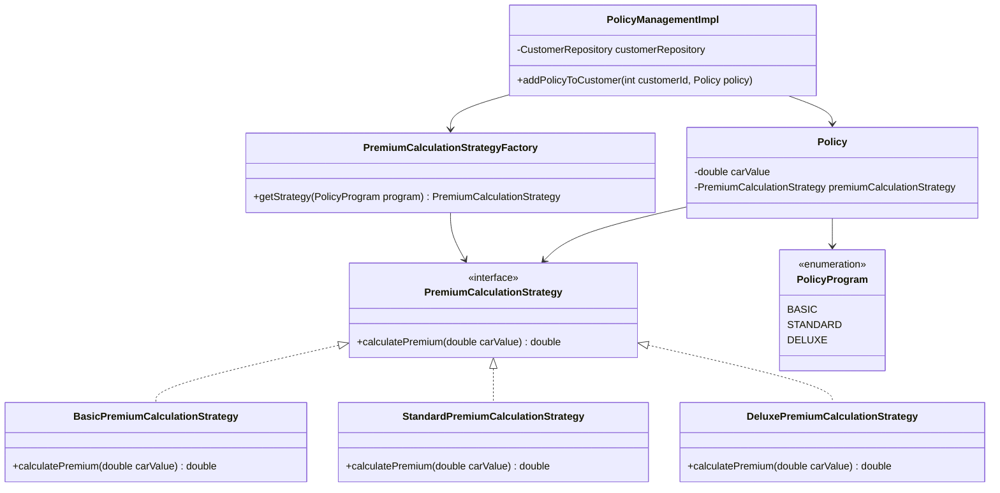
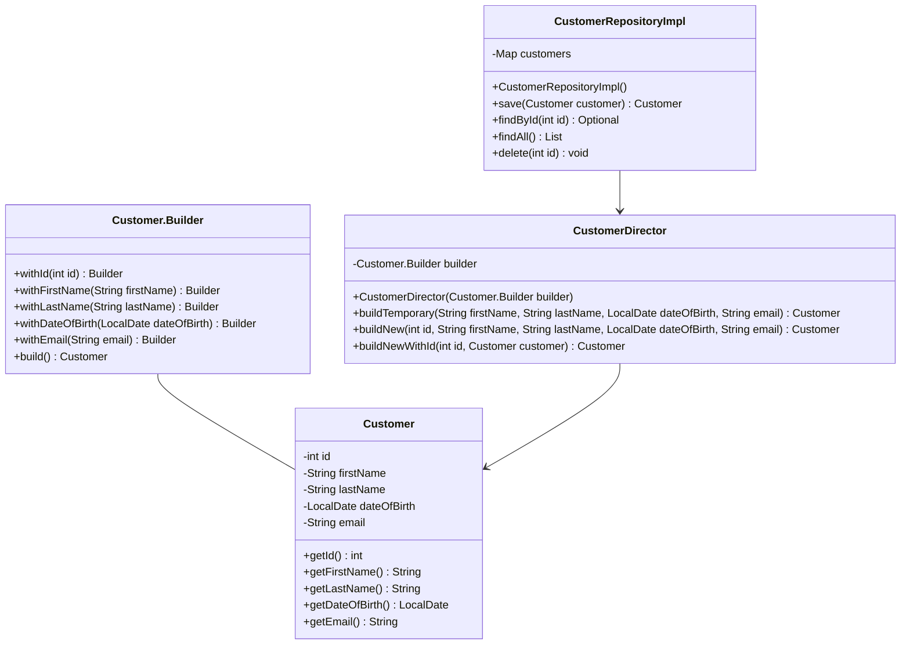
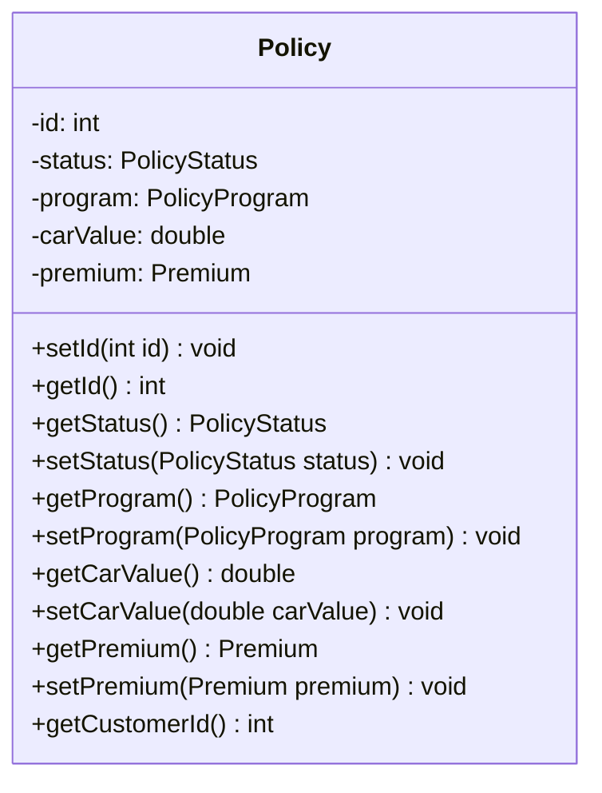
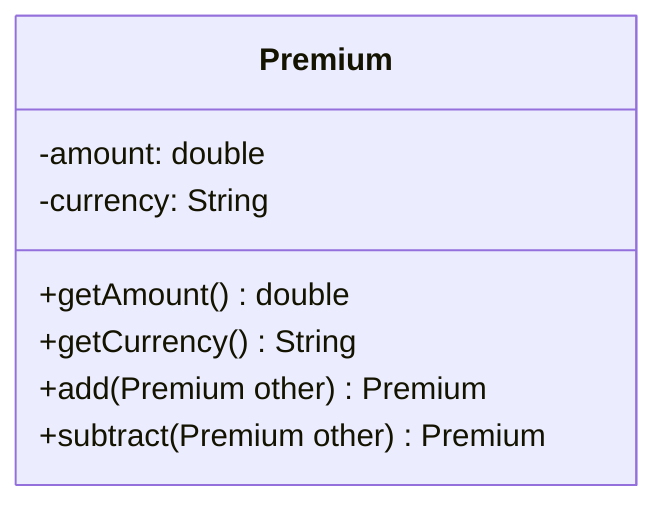
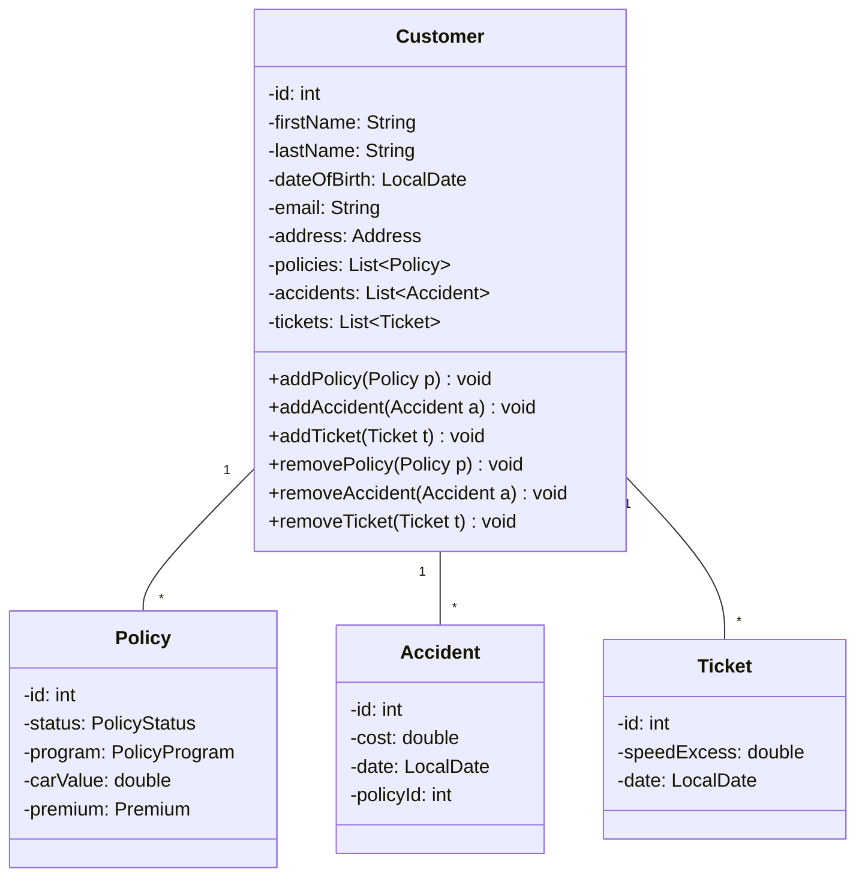
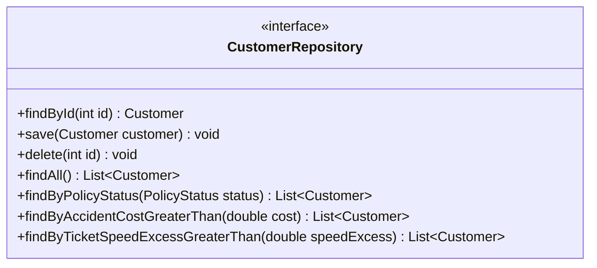

# Design Patterns
## Strategy Pattern

## Builder Pattern

# DDD
## Entities
- Customer
	- natürliche Person, die Kunde bei der von der Anwendung verwalteten Autoversicherung ist
	- Vor- und Nachname, PersonId, Geburtsdatum (vielleicht als VO), Mail, Adresse
- Policy
	- eine Versicherung, die ein Kunde für ein Auto abgeschlossen hat
	- Policystatus, entweder aktiv oder nicht aktiv
	- Policyprogram: Verweis auf ein Programm
	- CarValue
	- Premium (vielleicht als VO)
- Policyprogram
	- welche Art von Policy abgeschlossen wird
	- wirkt sich auf den Preis der Policy aus
	- Id, Name, Beschreibung
- Policystatus
	- beschreibt den Status einer abgeschlossenen Versicherung
  - vorhandene Status: aktive, inaktive, abgelehnt	
- Accidents
	- Unfälle, die ein Kunde begangen hat
	- Id, Schadenskosten, Datum
- Tickets
	- Verkehrsverstöße (in Bezug auf zu schnelles Fahren) von Kunden
	- Id, Datum, Geschwindigkeitsüberschreitung

## Nutzer
- Mitarbeiter der Versicherungsfirma
	- Kundenverwaltung
		- neuen Kunden im System anlegen
		- Policy für einen Kunden erstellen
		- alte Kunden und ihre Policys anzeigen
	- Accident hinzufügen
		- bei Kundenmeldung über einen Accident soll dieser in das System eingetragen werden
		- Änderungen an der spezifischen Policy des Kunden soll ersichtlicht werden
			- bis zu einer bestimmten Menge an Unfällen wird es teurer, die Policies können aber auch gekündigt werden
	- Ticket hinzufügen
		- bei Kundenmeldung über ein Ticket soll dieses in das System eingetragen werden
		- Änderungen an allen Policys des Kunden sollen ersichtlich werden
			- bis zu einer bestimmten Menge an Tickets oder ab einer bestimmten Geschwindigkeitsüberschreitung wird es teurer, die Policies können aber auch gekündigt werden

| Bezeichnung | Bedeutung                                                                               | Begründung                                                                                                                                                                                                                                                           |
| ----------- | --------------------------------------------------------------------------------------- | -------------------------------------------------------------------------------------------------------------------------------------------------------------------------------------------------------------------------------------------------------------------- |
| Policy      | eine Versicherung, die ein Kunde für ein Auto abgeschlossen hat                         | Ein Kunde schließt einen Vertrag für jede seiner Versicherungen ab (Insurance Policy). Bei einer Autoversicherung werden nur diese Art von Verträgen verwaltet, deswegen die kürzere Bezeichnung.                                                                    |
| Ticket      | Verkehrsverstöße von Kunden für zu schnelles Fahren                                     | Bei einer einer Autoversicherung sind für die Kostenberechnung einer Policy Geschwindigkeitsüberschreitungen releveant, da dadurch das Risiko eines Schadens erhöht wird. Andere Arten von Verkehrsvergehen, wie falsches Parken, werden dabei nicht berücksichtigt. |
| Customer    | natürliche Person, die Kunde bei der von der Anwendung verwalteten Autoversicherung ist | Kunden schließen einen Vertrag bei der Autoversicherung ab. Die Nutzer der Anwendung sind Mitarbeiter der Autoversicherung und tragen die Daten für die jeweiligen Kunden in das System ein.                                                                         |
| Premium     | die monatlichen Kosten einer Policy, um diese aktiv zu halten                           | Im Rahmen einer Versicherung wird Premium als der monatlich zu entrichtende Betrag definiert                                                                                                                                
## UML zu Entity

## Entities

### Policy Entity

**Beschreibung**  
Die Entität *Policy* repräsentiert eine Versicherungspolice, die ein Kunde für ein spezifisches Auto abgeschlossen hat. Sie enthält wesentliche Informationen wie den Status der Police, das gewählte Versicherungsprogramm, den Wert des versicherten Autos und die monatlichen Kosten.

**Begründung des Einsatzes:**  
Policy wird als Entity modelliert, weil:  
1. Sie eine eindeutige Identität hat (durch die id).  
2. Sie einen Lebenszyklus hat (der Status kann verändert werden).  
3. Sie sich im Laufe der Zeit ändern kann (z. B. Änderung der Kosten), behält aber ihre Identität.  
4. Sie eine zentrale Rolle im Modell spielt und mit anderen Entitäten (wie Customer) in Beziehung steht.  

---

## Value Objects

### Premium Value Object

**Beschreibung:**  
Das Value Object *Premium* repräsentiert den Geldbetrag, den ein Kunde monatlich für seine Versicherungspolice zahlt. Es kapselt den Betrag und die Währung.

**Begründung des Einsatzes:**  
Premium wird als Value Object modelliert, weil:  
1. Es keine eigene Identität hat - zwei Premium-Objekte mit dem gleichen Betrag und der gleichen Währung sind austauschbar.  
2. Es unveränderlich (immutable) ist - Änderungen erzeugen ein neues Objekt.  
3. Es Verhaltenslogik enthält (z. B. Addition, Subtraktion), die für alle Premium-Objekte gleich ist.  
4. Es ein konzeptionell zusammengehöriges Paar von Werten (Betrag und Währung) repräsentiert.  

---

## Aggregates

### Customer Aggregate

**Beschreibung:**  
Das Aggregate *Customer* gruppiert die Entitäten Customer, Policy, Accident und Ticket. Customer fungiert als Aggregate Root und hat direkte Verbindungen zu seinen Policies, Accidents und Tickets.

**Begründung des Einsatzes:**  
Ein Aggregat wird hier eingesetzt, weil:  
1. Es eine logische Gruppierung zusammengehöriger Entitäten darstellt. Ein Kunde hat Policys, Unfälle und Tickets, die alle direkten Einfluss auf die Versicherungskosten haben.  
2. Es die Konsistenz der Daten sicherstellt. Änderungen an Policies, Accidents oder Tickets müssen immer im Kontext des zugehörigen Kunden erfolgen.  
3. Es die Komplexität reduziert, indem es einen einzelnen Zugriffspunkt (Customer als Aggregate Root) für zusammengehörige Daten bietet.  

---

## Repositories

### Customer Repository

**Beschreibung:**  
Das Repository *Customer* ist verantwortlich für die Persistenz und das Abrufen des Aggregates Customer. Es bietet Methoden zum Finden, Speichern, Aktualisieren und Löschen von Kunden.

**Begründung des Einsatzes:**  
Ein Repository für Customer wird eingesetzt, weil:  
1. Es die Datenzugriffslogik von der Geschäftslogik trennt.  
2. Es eine Abstraktion der Datenpersistenz bietet, wodurch die zugrunde liegende Datenbank ohne Änderungen an der Geschäftslogik geändert werden kann.  
3. Es ermöglicht, komplexe Abfragen zu kapseln (z. B. findByName). 
4. Es unterstützt das Prinzip der Aggregate Root in DDD, da Customer ein Aggregate Root ist.  

