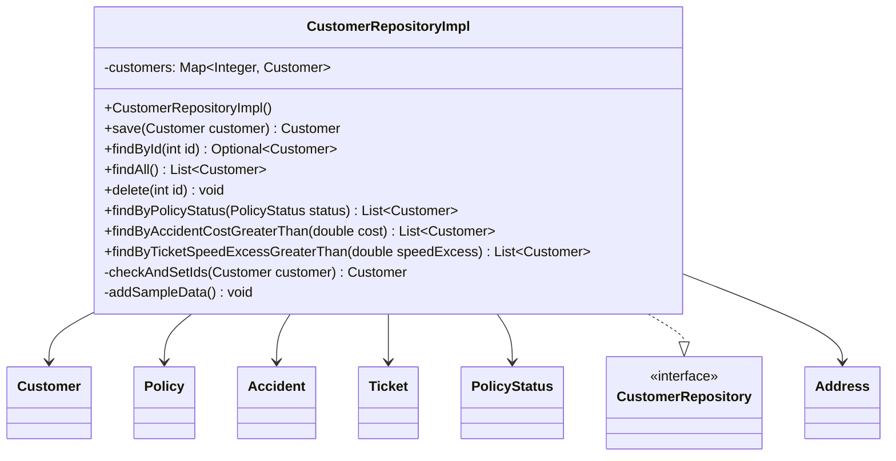
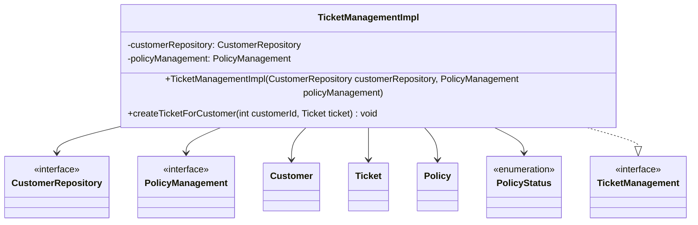
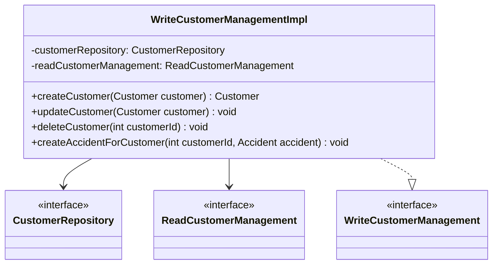
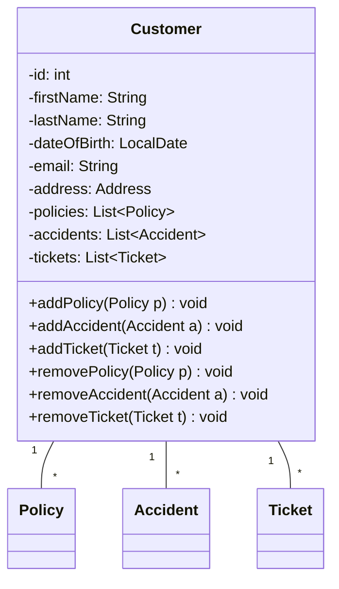
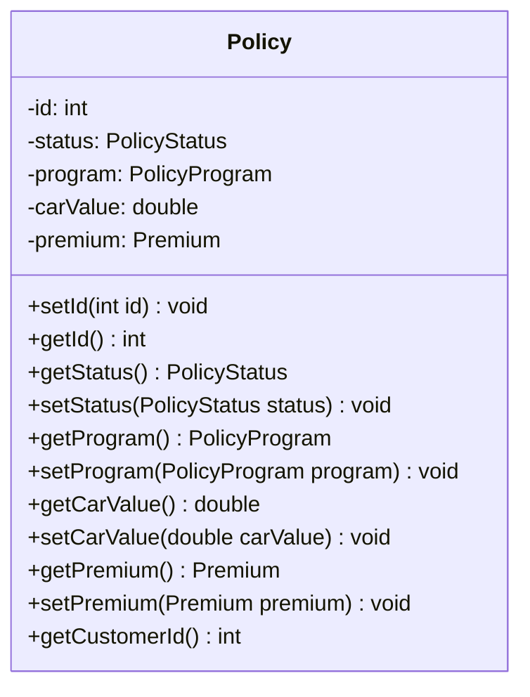
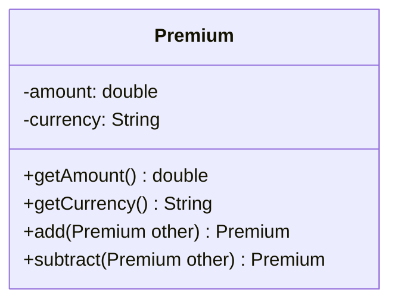
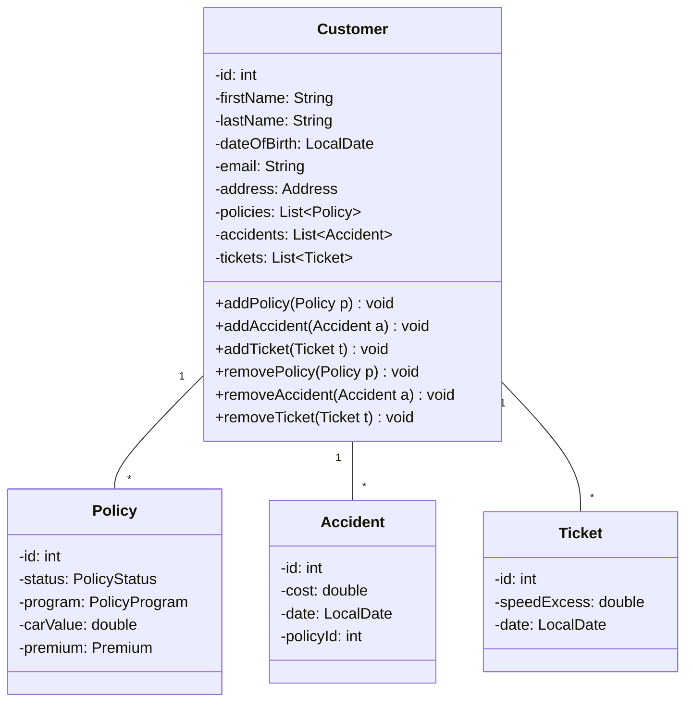
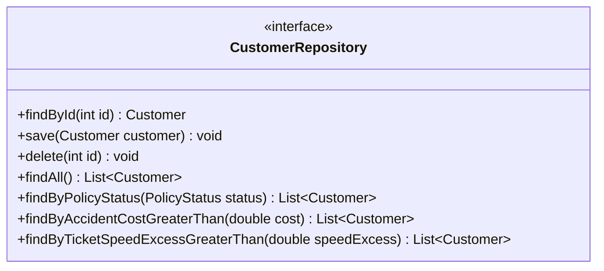
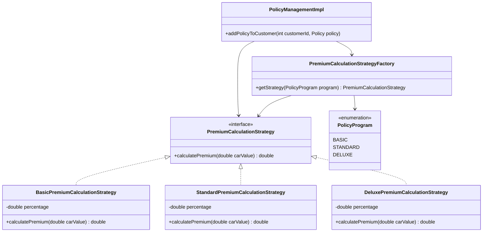
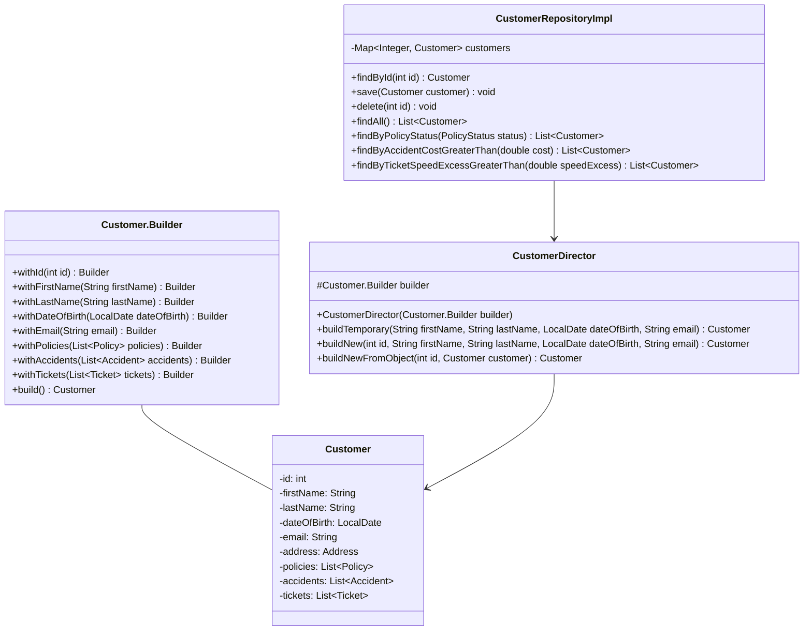

# 1. Einführung
## Übersicht über die Applikation
Die Applikation SRI (_Simon Stefan Insuranci_) ist eine Software zur Verwaltung von Autoversicherungen. Sie ermöglicht es, Versicherungspolicen für Kunden zu erstellen und zu verwalten. Die Applikation berechnet die Versicherungskosten basierend auf verschiedenen Faktoren wie dem Wert des Autos, dem Alter des Kunden, Verkehrsverstößen wie Tickets und Unfällen.
 
**Funktionsweise:**
1. **Kostenberechnung:** Die Applikation verwendet verschiedene Strategien zur Berechnung der Versicherungsprämien (z.B. Basic, Standard, Deluxe).
2. **Regeln:** Es gibt spezifische Regeln, die die Prämien beeinflussen, wie zusätzliche Gebühren für junge oder ältere Fahrer, erhöhte Prämien bei Verkehrsverstößen und Unfällen, sowie Ausschlusskriterien für sehr teure Autos.
3. **Verwaltung:** Mitarbeiter der Versicherungsfirma können Kunden und deren Policen verwalten, Unfälle und Tickets hinzufügen und die Auswirkungen auf die Prämien sehen.
 
**Zweck:**
Die Applikation soll den Prozess der Verwaltung von Autoversicherungen effizienter und transparenter gestalten, indem sie automatisierte Berechnungen und klare Regeln zur Prämienbestimmung bietet.

## Wie startet man die Applikation?

**Voraussetzungen:**
- Java Development Kit (JDK) Version 21
- Apache Maven Version 3.9.9
 
**Schritt-für-Schritt-Anleitung:**

1. **Repository klonen:**
   ```sh
   git clone https://github.com/SirSimon04/clean-car-insurance
   cd clean-car-insurance
   ```

2. **Projekt bauen:**
   ```sh
   mvn clean install
   ```

3. **Applikation starten:**
   ```sh
   cd 0-insurance-main
   mvn exec:java -Dexec.mainClass="de.sri.Main"
   ```
 
## Wie testet man die Applikation?
```sh
mvn test
```

Die Testergebnisse werden im Terminal angezeigt. Stelle sicher, dass alle Tests erfolgreich sind.

# 2. Clean Architecture

## Was ist Clean Architecture?

Clean Architecture ist ein Architekturstil für Software, der darauf abzielt, die Abhängigkeiten zwischen den verschiedenen Komponenten einer Anwendung zu minimieren und die Testbarkeit, Wartbarkeit und Flexibilität zu erhöhen. Die Hauptidee ist, dass die Geschäftslogik (Use Cases) unabhängig von Frameworks, Datenbanken, UI oder anderen externen Systemen bleibt. Dies wird durch die strikte Trennung der Verantwortlichkeiten und die Einhaltung der Dependency Rule erreicht.

## Analyse der Dependency Rule
Aufgrund der Projektstruktur wird die Dependency Rule der Clean Architecture immer befolgt und kann nicht dagegen verstoßen werden. Deswegen werden zwei positive Beispiele aufgeführt.

```shell
├── 0-insurance-main
├── 1-insurance-adapters
├── 2-insurance-application
├── 3-insurance-domain
├── Autoversicherung.md
├── README.md
└── pom.xml
```


### (a) Positiv-Beispiel: Dependency Rule

**Klasse: `CustomerRepositoryImpl`**

**UML:**


**Analyse:**

- **Abhängigkeiten:** `CustomerRepositoryImpl` hängt von dem Interfaces `CustomerRepository` und sämtlichen Entity Klassen ab.
- **Einhaltung der Dependency Rule:** Die Klasse `CustomerRepositoryImpl` befindet sich im Applikations-Schicht und die abhängenden Entitäten befinden sich in der Domain-Schicht. Dies entspricht der Dependency Rule, da die Abhängigkeiten von außen nach innen verlaufen und nicht umgekehrt.

### (b) Positiv-Beispiel: Dependency Rule

**Klasse: `PolicyManagementImpl`**

**UML:**



**Analyse:**

- **Abhängigkeiten:** `TicketManagementImpl` implementiert das Interface `TicketManagement` und hängt von den Interfaces `CustomerRepository` und `PolicyManagement` sowie weiteren Entity-Klassen ab.
- **Einhaltung der Dependency Rule:** Die Klasse `TicketManagementImpl` befindet sich im Applikations-Schicht und die Interfaces sowie die abhängenden Entitäten befinden sich in der Domain-Schicht. Dies entspricht der Dependency Rule, da die Abhängigkeiten von außen nach innen verlaufen und nicht umgekehrt.

## Analyse der Schichten

### Schicht: Applikations-Schicht

**Klasse: `CustomerManagementUseCase`**

**UML:**



**Beschreibung der Aufgabe:**

Die Klasse `WriteCustomerManagementImpl` ist verantwortlich für die schreibende Verwaltung der Kunden. Sie bietet Methoden zum Hinzufügen, Entfernen und Aktualisieren von Kunden. Sie interagiert mit dem `CustomerRepository`, um die Datenpersistenz zu gewährleisten.

**Einordnung in die Clean-Architecture:**

Die Klasse gehört zu der Applikations-Schicht, da sie die Geschäftslogik für die Verwaltung der Kunden kapselt. Sie stellt sicher, dass die Geschäftslogik unabhängig von der Datenpersistenz bleibt und nur über Abstraktionen (Interfaces) mit der Datenbank interagiert. Die Interfaces gehören alle zur Domain-Schicht.

### Schicht: Domain-Schicht

**Klasse: `Customer`**

**UML:**



**Beschreibung der Aufgabe:**

Die Klasse `Customer` repräsentiert einen Kunden der Autoversicherung. Sie enthält alle relevanten Informationen über den Kunden, wie Name, Geburtsdatum, Adresse und die Liste der Policies, Accidents und Tickets.

**Einordnung in die Clean-Architecture:**

Die Klasse gehört zur Domain-Schicht, da sie eine zentrale Rolle in der Domäne der Applikation spielt und die wesentlichen Daten eines Kunden kapselt. Sie ist unabhängig von anderen Schichten und kann in verschiedenen Klassen der Applikations-Schicht konsumiert werden.


# 7. Domain-Driven-Design (DDD)
## Entities
- Customer
	- natürliche Person, die Kunde bei der von der Anwendung verwalteten Autoversicherung ist
	- Vor- und Nachname, PersonId, Geburtsdatum (vielleicht als VO), Mail, Adresse
- Policy
	- eine Versicherung, die ein Kunde für ein Auto abgeschlossen hat
	- Policystatus, entweder aktiv oder nicht aktiv
	- Policyprogram: Verweis auf ein Programm
	- CarValue
	- Premium (vielleicht als VO)
- Policyprogram
	- welche Art von Policy abgeschlossen wird
	- wirkt sich auf den Preis der Policy aus
	- Id, Name, Beschreibung
- Policystatus
	- beschreibt den Status einer abgeschlossenen Versicherung
  - vorhandene Status: aktive, inaktive, abgelehnt	
- Accidents
	- Unfälle, die ein Kunde begangen hat
	- Id, Schadenskosten, Datum
- Tickets
	- Verkehrsverstöße (in Bezug auf zu schnelles Fahren) von Kunden
	- Id, Datum, Geschwindigkeitsüberschreitung


## Nutzer
- Mitarbeiter der Versicherungsfirma
	- Kundenverwaltung
		- neuen Kunden im System anlegen
		- Policy für einen Kunden erstellen
		- alte Kunden und ihre Policys anzeigen
	- Accident hinzufügen
		- bei Kundenmeldung über einen Accident soll dieser in das System eingetragen werden
		- Änderungen an der spezifischen Policy des Kunden soll ersichtlicht werden
			- bis zu einer bestimmten Menge an Unfällen wird es teurer, die Policies können aber auch gekündigt werden
	- Ticket hinzufügen
		- bei Kundenmeldung über ein Ticket soll dieses in das System eingetragen werden
		- Änderungen an allen Policys des Kunden sollen ersichtlich werden
			- bis zu einer bestimmten Menge an Tickets oder ab einer bestimmten Geschwindigkeitsüberschreitung wird es teurer, die Policies können aber auch gekündigt werden


| Bezeichnung | Bedeutung                                                                               | Begründung                                                                                                                                                                                                                                                           |
| ----------- | --------------------------------------------------------------------------------------- | -------------------------------------------------------------------------------------------------------------------------------------------------------------------------------------------------------------------------------------------------------------------- |
| Policy      | eine Versicherung, die ein Kunde für ein Auto abgeschlossen hat                         | Ein Kunde schließt einen Vertrag für jede seiner Versicherungen ab (Insurance Policy). Bei einer Autoversicherung werden nur diese Art von Verträgen verwaltet, deswegen die kürzere Bezeichnung.                                                                    |
| Ticket      | Verkehrsverstöße von Kunden für zu schnelles Fahren                                     | Bei einer einer Autoversicherung sind für die Kostenberechnung einer Policy Geschwindigkeitsüberschreitungen releveant, da dadurch das Risiko eines Schadens erhöht wird. Andere Arten von Verkehrsvergehen, wie falsches Parken, werden dabei nicht berücksichtigt. |
| Customer    | natürliche Person, die Kunde bei der von der Anwendung verwalteten Autoversicherung ist | Kunden schließen einen Vertrag bei der Autoversicherung ab. Die Nutzer der Anwendung sind Mitarbeiter der Autoversicherung und tragen die Daten für die jeweiligen Kunden in das System ein.                                                                         |
| Premium     | die monatlichen Kosten einer Policy, um diese aktiv zu halten                           | Im Rahmen einer Versicherung wird Premium als der monatlich zu entrichtende Betrag definiert                                                                                                                                
## UML zu Entity

## Entities

### Policy Entity




**Beschreibung**  
Die Entität *Policy* repräsentiert eine Versicherungspolice, die ein Kunde für ein spezifisches Auto abgeschlossen hat. Sie enthält wesentliche Informationen wie den Status der Police, das gewählte Versicherungsprogramm, den Wert des versicherten Autos und die monatlichen Kosten.

**Begründung des Einsatzes:**  
Policy wird als Entity modelliert, weil:  
1. Sie eine eindeutige Identität hat (durch die id).  
2. Sie einen Lebenszyklus hat (der Status kann verändert werden).  
3. Sie sich im Laufe der Zeit ändern kann (z. B. Änderung der Kosten), behält aber ihre Identität.  
4. Sie eine zentrale Rolle im Modell spielt und mit anderen Entitäten (wie Customer) in Beziehung steht.  

---

## Value Objects

### Premium Value Object



**Beschreibung:**  
Das Value Object *Premium* repräsentiert den Geldbetrag, den ein Kunde monatlich für seine Versicherungspolice zahlt. Es kapselt den Betrag und die Währung.

**Begründung des Einsatzes:**  
Premium wird als Value Object modelliert, weil:  
1. Es keine eigene Identität hat - zwei Premium-Objekte mit dem gleichen Betrag und der gleichen Währung sind austauschbar.  
2. Es unveränderlich (immutable) ist - Änderungen erzeugen ein neues Objekt.  
3. Es Verhaltenslogik enthält (z. B. Addition, Subtraktion), die für alle Premium-Objekte gleich ist.  
4. Es ein konzeptionell zusammengehöriges Paar von Werten (Betrag und Währung) repräsentiert.  

---

## Aggregates

### Customer Aggregate



**Beschreibung:**  
Das Aggregate *Customer* gruppiert die Entitäten Customer, Policy, Accident und Ticket. Customer fungiert als Aggregate Root und hat direkte Verbindungen zu seinen Policies, Accidents und Tickets.

**Begründung des Einsatzes:**  
Ein Aggregat wird hier eingesetzt, weil:  
1. Es eine logische Gruppierung zusammengehöriger Entitäten darstellt. Ein Kunde hat Policys, Unfälle und Tickets, die alle direkten Einfluss auf die Versicherungskosten haben.  
2. Es die Konsistenz der Daten sicherstellt. Änderungen an Policies, Accidents oder Tickets müssen immer im Kontext des zugehörigen Kunden erfolgen.  
3. Es die Komplexität reduziert, indem es einen einzelnen Zugriffspunkt (Customer als Aggregate Root) für zusammengehörige Daten bietet.  

---

## Repositories

### Customer Repository



**Beschreibung:**  
Das Repository *Customer* ist verantwortlich für die Persistenz und das Abrufen des Aggregates Customer. Es bietet Methoden zum Finden, Speichern, Aktualisieren und Löschen von Kunden.

**Begründung des Einsatzes:**  
Ein Repository für Customer wird eingesetzt, weil:  
1. Es die Datenzugriffslogik von der Geschäftslogik trennt.  
2. Es eine Abstraktion der Datenpersistenz bietet, wodurch die zugrunde liegende Datenbank ohne Änderungen an der Geschäftslogik geändert werden kann.  
3. Es ermöglicht, komplexe Abfragen zu kapseln (z. B. findByName). 
4. Es unterstützt das Prinzip der Aggregate Root in DDD, da Customer ein Aggregate Root ist.  


# 8. Design Patterns
## Strategy Pattern


## Builder Pattern
