# 1. Einführung
## Übersicht über die Applikation
Die Applikation SRI (_Simon Stefan Insuranci_) ist eine Software zur Verwaltung von Autoversicherungen. Sie ermöglicht es, VersicherungsPolicies für Kunden zu erstellen und zu verwalten. Die Applikation berechnet die Versicherungskosten basierend auf verschiedenen Faktoren wie dem Wert des Autos, dem Alter des Kunden, Verkehrsverstößen wie Tickets und Unfällen.
 
**Funktionsweise:**
1. **Kostenberechnung:** Die Applikation verwendet verschiedene Strategien zur Berechnung der Versicherungsprämien (z.B. Basic, Standard, Deluxe).
2. **Regeln:** Es gibt spezifische Regeln, die die Prämien beeinflussen, wie zusätzliche Gebühren für junge oder ältere Fahrer, erhöhte Prämien bei Verkehrsverstößen und Unfällen, sowie Ausschlusskriterien für sehr teure Autos.
3. **Verwaltung:** Mitarbeiter der Versicherungsfirma können Kunden und deren Policies verwalten, Unfälle und Tickets hinzufügen und die Auswirkungen auf die Prämien sehen.
 
**Zweck:**
Die Applikation soll den Prozess der Verwaltung von Autoversicherungen effizienter und transparenter gestalten, indem sie automatisierte Berechnungen und klare Regeln zur Prämienbestimmung bietet.

## Wie startet man die Applikation?

**Voraussetzungen:**
- Java Development Kit (JDK) Version 21
- Apache Maven Version 3.9.9
 
**Schritt-für-Schritt-Anleitung:**

1. **Repository klonen:**
   ```sh
   git clone https://github.com/SirSimon04/clean-car-insurance
   cd clean-car-insurance
   ```

2. **Projekt bauen:**
   ```sh
   mvn clean install
   ```

3. **Applikation starten:**
   ```sh
   cd 0-insurance-main
   mvn exec:java -Dexec.mainClass="de.sri.Main"
   ```
 
## Wie testet man die Applikation?
```sh
mvn test
```

Die Testergebnisse werden im Terminal angezeigt. Stelle sicher, dass alle Tests erfolgreich sind.

# 2. Clean Architecture

## Was ist Clean Architecture?

Clean Architecture ist ein Architekturstil für Software, der darauf abzielt, die Abhängigkeiten zwischen den verschiedenen Komponenten einer Anwendung zu minimieren und die Testbarkeit, Wartbarkeit und Flexibilität zu erhöhen. Die Hauptidee ist, dass die Geschäftslogik (Use Cases) unabhängig von Frameworks, Datenbanken, UI oder anderen externen Systemen bleibt. Dies wird durch die strikte Trennung der Verantwortlichkeiten und die Einhaltung der Dependency Rule erreicht.

## Analyse der Dependency Rule
Aufgrund der Projektstruktur wird die Dependency Rule der Clean Architecture immer befolgt und kann nicht dagegen verstoßen werden. Deswegen werden zwei positive Beispiele aufgeführt.

```shell
├── 0-insurance-main
├── 1-insurance-adapters
├── 2-insurance-application
├── 3-insurance-domain
├── Autoversicherung.md
├── README.md
└── pom.xml
```


### (a) Positiv-Beispiel: Dependency Rule

**Klasse: `CustomerRepositoryImpl`**

**UML:**
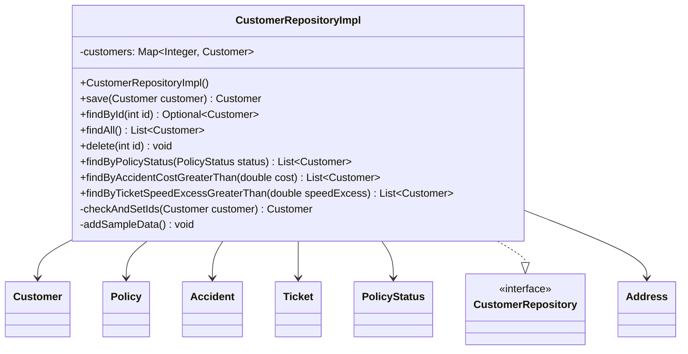

**Analyse:**

- **Abhängigkeiten:** `CustomerRepositoryImpl` hängt von dem Interfaces `CustomerRepository` und sämtlichen Entity Klassen ab.
- **Einhaltung der Dependency Rule:** Die Klasse `CustomerRepositoryImpl` befindet sich im Applikations-Schicht und die abhängenden Entitäten befinden sich in der Domain-Schicht. Dies entspricht der Dependency Rule, da die Abhängigkeiten von außen nach innen verlaufen und nicht umgekehrt.

### (b) Positiv-Beispiel: Dependency Rule

**Klasse: `PolicyManagementImpl`**

**UML:**

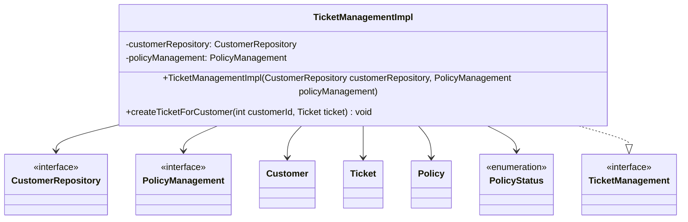

**Analyse:**

- **Abhängigkeiten:** `TicketManagementImpl` implementiert das Interface `TicketManagement` und hängt von den Interfaces `CustomerRepository` und `PolicyManagement` sowie weiteren Entity-Klassen ab.
- **Einhaltung der Dependency Rule:** Die Klasse `TicketManagementImpl` befindet sich im Applikations-Schicht und die Interfaces sowie die abhängenden Entitäten befinden sich in der Domain-Schicht. Dies entspricht der Dependency Rule, da die Abhängigkeiten von außen nach innen verlaufen und nicht umgekehrt.

## Analyse der Schichten

### Schicht: Applikations-Schicht

**Klasse: `CustomerManagementUseCase`**

**UML:**

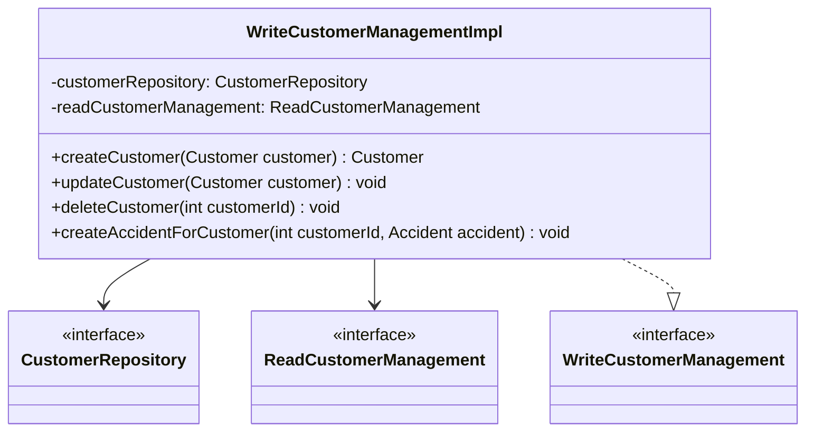

**Beschreibung der Aufgabe:**

Die Klasse `WriteCustomerManagementImpl` ist verantwortlich für die schreibende Verwaltung der Kunden. Sie bietet Methoden zum Hinzufügen, Entfernen und Aktualisieren von Kunden. Sie interagiert mit dem `CustomerRepository`, um die Datenpersistenz zu gewährleisten.

**Einordnung in die Clean-Architecture:**

Die Klasse gehört zu der Applikations-Schicht, da sie die Geschäftslogik für die Verwaltung der Kunden kapselt. Sie stellt sicher, dass die Geschäftslogik unabhängig von der Datenpersistenz bleibt und nur über Abstraktionen (Interfaces) mit der Datenbank interagiert. Die Interfaces gehören alle zur Domain-Schicht.

### Schicht: Domain-Schicht

**Klasse: `Customer`**

**UML:**

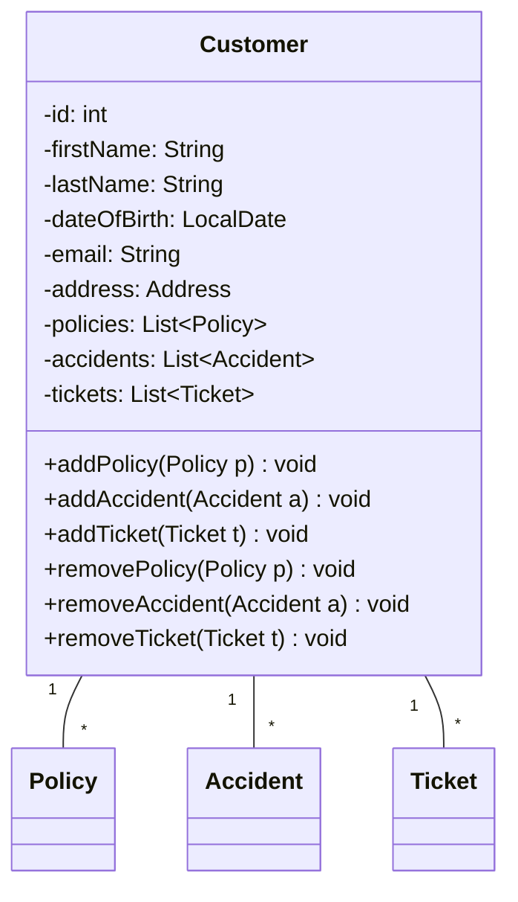

**Beschreibung der Aufgabe:**

Die Klasse `Customer` repräsentiert einen Kunden der Autoversicherung. Sie enthält alle relevanten Informationen über den Kunden, wie Name, Geburtsdatum, Adresse und die Liste der Policies, Accidents und Tickets.

**Einordnung in die Clean-Architecture:**

Die Klasse gehört zur Domain-Schicht, da sie eine zentrale Rolle in der Domäne der Applikation spielt und die wesentlichen Daten eines Kunden kapselt. Sie ist unabhängig von anderen Schichten und kann in verschiedenen Klassen der Applikations-Schicht konsumiert werden.

# Kapitel 3: SOLID
 
## Analyse Single-Responsibility-Principle (SRP)
 
**Positiv-Beispiel:**
 
**Klasse: `BasicPremiumCalculationStrategy`**
 
**UML:**
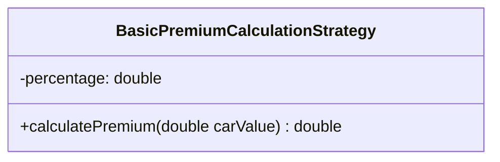
 
**Beschreibung der Aufgabe:**
Die Klasse `BasicPremiumCalculationStrategy` hat nur eine einzige Verantwortung: die Berechnung des Premiums basierend auf einem festen Prozentsatz des Autowertes. Sie erfüllt das SRP, da sie nur eine Aufgabe hat und diese klar definiert ist.
 
**Negativ-Beispiel:**
 
**Klasse: `WriteCustomerManagementImpl`**
 
**UML:**
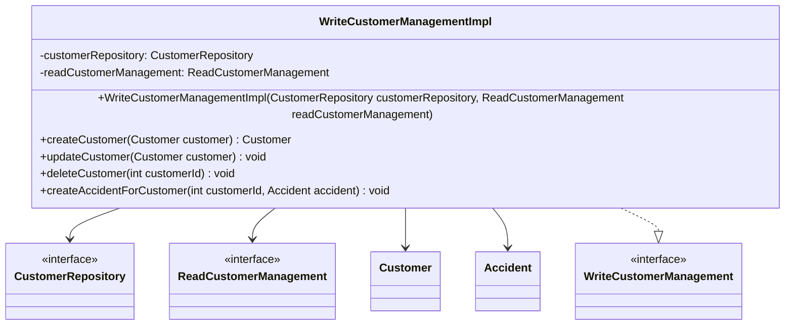
 
**Beschreibung der Aufgaben:**
Die Klasse `WriteCustomerManagementImpl` hat mehrere Verantwortlichkeiten: das Erstellen, Aktualisieren und Löschen von Kunden sowie das Hinzufügen von Unfällen zu Kunden. Dies verletzt das SRP, da die Klasse mehrere Aufgaben hat.
 
**Möglicher Lösungsweg:**
Aufteilung der Klasse `WriteCustomerManagementImpl` in einen `CustomerCreationService`, `CustomerUpdateService`, `CustomerDeletionService` und `AccidentManagementService`. Dadurch werden die mehreren Verantwortlichkeiten in mehrere einzelnen Klassen gekapselt. 
 
**UML:**
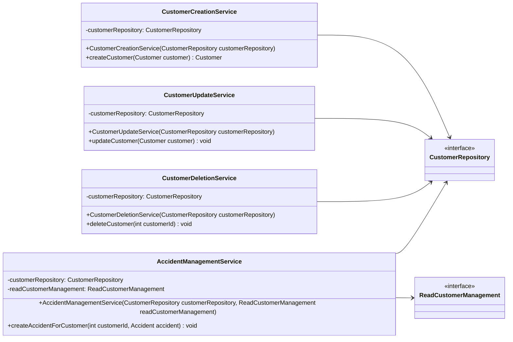
 
## Analyse Open-Closed-Principle (OCP)
 
### Positiv-Beispiel
 
**Klasse: `PremiumCalculationStrategyFactory`**
 
**UML:**
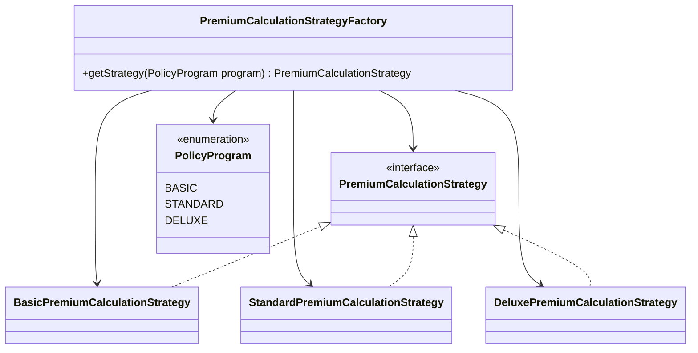
 
**Analyse:**
Die Klasse `PremiumCalculationStrategyFactory` ist offen für Erweiterungen, da neue Berechnungsstrategien für das Premium hinzugefügt werden können, ohne die bestehende Klasse zu ändern. Dies wird durch die Verwendung eines Enums und eines Switch-Statements erreicht, das leicht erweitert werden kann ([repo](https://github.com/SirSimon04/clean-car-insurance/blob/main/2-insurance-application/src/main/java/de/sri/application/premiumcalculator/PremiumCalculationStrategyFactory.java)).
 
### Negativ-Beispiel
 
**Klasse: `WriteCustomerManagementImpl`**
 
**UML:**
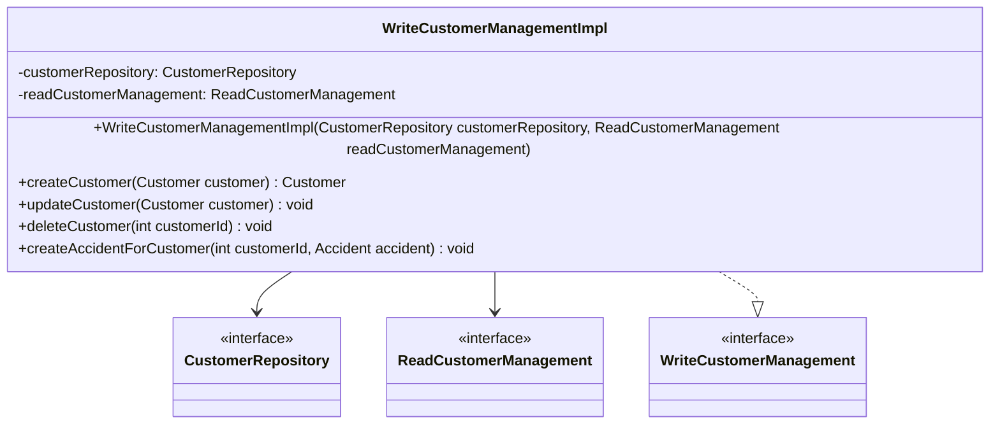
 
**Analyse:**
Die Klasse `WriteCustomerManagementImpl` ist nicht offen für Erweiterungen, da jede neue Funktionalität (z.B. das Hinzufügen neuer Methoden) Änderungen an der bestehenden Klasse erfordert. Dies verletzt das OCP.
 
**Möglicher Lösungsweg:**
 
**UML:**
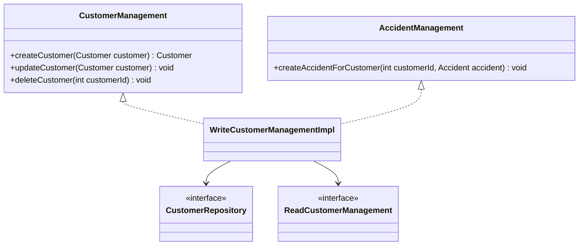
 
## Analyse Interface-Segregation-Principle (ISP)
 
### Positiv-Beispiel

**Analyse:**
Die Interfaces `ReadCustomerManagement` und `WriteCustomerManagement` sind nach Funktionalität (Lese- und Schreibzugriff) aufgeteilt. Dies erfüllt das ISP, da die Implementierungen nicht gezwungen sind, unnötige Methoden zu implementieren. Dadurch kann verhindert werden, dass ungewollte Schreibzugriffe ausgeführt werden.
 
#### Interface: `ReadCustomerManagement`
 
**UML:**
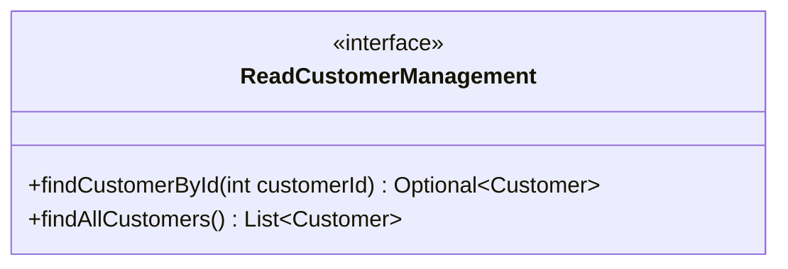
 
#### Interface: `WriteCustomerManagement`
 
**UML:**
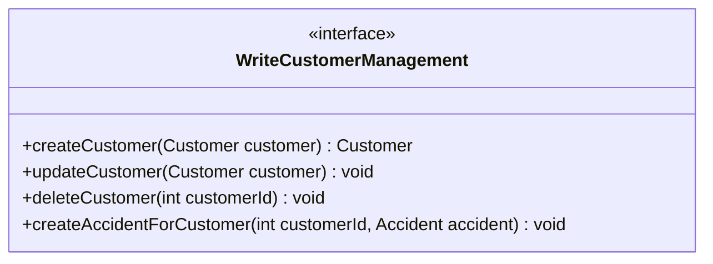
 
 
### Negativ-Beispiel
 
**Klasse: `CustomerRepository`**
 
**UML:**
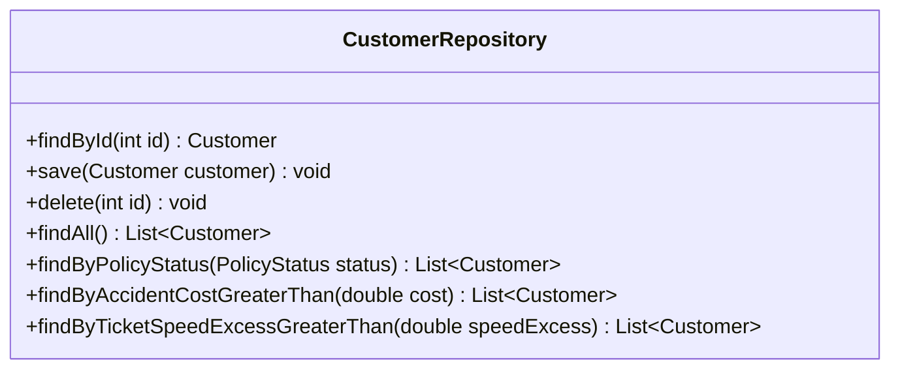
 
**Analyse:**
Das Interface `CustomerRepository` hat viele Methoden, die möglicherweise nicht von allen Implementierungen benötigt werden. Dies verletzt das ISP, da Implementierungen gezwungen sind, Methoden zu implementieren, die sie nicht benötigen.
 
**Möglicher Lösungsweg:**
 
**UML:**
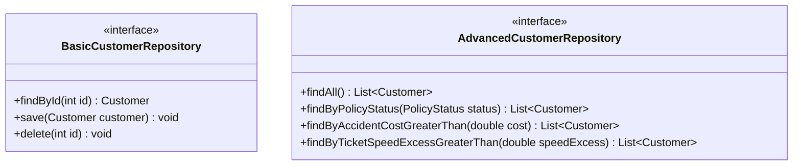
 
**Beschreibung:**
Durch die Aufteilung des `CustomerRepository`-Interfaces in `BasicCustomerRepository` und `AdvancedCustomerRepository` wird das ISP erfüllt, da Implementierungen nur die Methoden implementieren müssen, die sie tatsächlich benötigen.

# 4. Weitere Prinzipien  
TODO

# 5. Unit Tests
## 10 Unit Tests
Die folgenden aufgeführten Tests befinden sich in der `PolicyManagementImplTest` Klasse. 
 
| Unit Test | Beschreibung |
|-----------|--------------|
| `add_basic_policy` | Testet das Hinzufügen einer BASIC-Policy zu einem Kunden und überprüft die Prämienberechnung und die Anzahl der Policies des Kunden. |
| `add_policy_basic_with_young_driver` | Testet das Hinzufügen einer BASIC-Policy zu einem jungen Fahrer und überprüft die Prämienberechnung und die Anzahl der Policies des Kunden. |
| `add_policy_basic_with_senior_driver` | Testet das Hinzufügen einer BASIC-Policy zu einem älteren Fahrer und überprüft die Prämienberechnung und die Anzahl der Policies des Kunden. |
| `add_basic_policy_with_car_value_fee` | Testet das Hinzufügen einer BASIC-Policy mit einem hohen Autowert und überprüft die Prämienberechnung und die Anzahl der Policies des Kunden. |
| `add_standard_policy` | Testet das Hinzufügen einer STANDARD-Policy zu einem Kunden und überprüft die Prämienberechnung und die Anzahl der Policies des Kunden. |
| `add_deluxe_policy` | Testet das Hinzufügen einer DELUXE-Policy zu einem Kunden und überprüft die Prämienberechnung und die Anzahl der Policies des Kunden. |
| `add_policy_with_too_high_car_value` | Testet das Hinzufügen einer Policy mit einem zu hohen Autowert und überprüft, ob eine `CarTooExpensiveException` geworfen wird. |
| `add_policy_with_customer_under_18_years_old` | Testet das Hinzufügen einer Policy zu einem Kunden unter 18 Jahren und überprüft, ob eine `CustomerTooYoungException` geworfen wird. |
| `increase_all_policies_premium` | Testet die Erhöhung der Prämien aller Policies eines Kunden und überprüft die neue Prämienhöhe. |
| `add_policy_with_customer_not_found` | Testet das Hinzufügen einer Policy zu einem nicht existierenden Kunden und überprüft, ob eine `CustomerNotFoundException` geworfen wird. |
 
### ATRIP: Automatic
 
**Begründung für automatisches Testen**

JUnit-Tests werden in einem Maven-Projekt automatisch während der Test-Phase ausgeführt, weil Maven das `maven-surefire-plugin` standardmäßig verwendet. Dieses Plugin ist darauf ausgelegt, JUnit-Tests zu erkennen und auszuführen.
 
### ATRIP: Thorough
 
**Positiv-Beispiel: Thorough**
 
**Code-Beispiel:**

```java
@Test
void add_basic_policy() throws CustomerNotFoundException, CustomerTooYoungException, CarTooExpensiveException {
    Customer customer = new TestCustomerDirector(new Customer.Builder()).createMockUser();
    when(customerRepository.findById(1)).thenReturn(Optional.of(customer));
 
    Policy policy = new Policy(1, PolicyStatus.ACTIVE, PolicyProgram.BASIC, 10000);
    policyManagement.addPolicyToCustomer(1, policy);
 
    assertEquals(500, policy.getPremium().getAmount());
    assertEquals(1, customer.getPolicies().size());
    assertEquals(policy, customer.getPolicies().get(0));
}
```
 
**Analyse und Begründung:**

Dieser Test ist gründlich, da er die Berechnung der Prämie für eine BASIC-Policy überprüft und sicherstellt, dass die Policy korrekt zum Kunden hinzugefügt wird. Es werden mehrere Assertions verwendet, um verschiedene Aspekte des Ergebnisses zu validieren.
 
**Positiv-Beispiel: Thorough**
 
**Code-Beispiel:**
```java
@Test
void add_policy_with_customer_not_found() throws CustomerNotFoundException, CustomerTooYoungException, CarTooExpensiveException {
    when(customerRepository.findById(1)).thenReturn(Optional.empty());

    Policy policy = new Policy(1, PolicyStatus.ACTIVE, PolicyProgram.BASIC, 10000);

    CustomerNotFoundException exception = assertThrows(CustomerNotFoundException.class,() -> policyManagement.addPolicyToCustomer(1, policy));
    assertEquals("The user with id 1 was not found.", exception.getMessage());
}
```
 
**Analyse und Begründung:**

Dieser Test ist gründlich, da er nur überprüft, ob eine `CustomerNotFoundException` geworfen wird, wenn eine Policy für einen nicht existierenden Customer hinzugefügt werden soll.
 
### ATRIP: Professional
 
**Positiv-Beispiel: Professional**
 
**Code-Beispiel:**

```java
@Test
void add_policy_with_too_high_car_value() {
    Customer customer = new TestCustomerDirector(new Customer.Builder()).createMockUser();
    when(customerRepository.findById(1)).thenReturn(Optional.of(customer));
 
    Policy policy = new Policy(1, PolicyStatus.ACTIVE, PolicyProgram.BASIC, 120000);
    CarTooExpensiveException exception = assertThrows(CarTooExpensiveException.class, () -> policyManagement.addPolicyToCustomer(1, policy));

    assertEquals("Car value cannot be more than 100000!", exception.getMessage());
}
```
 
**Analyse und Begründung:**

Dieser Test ist professionell, da er sicherstellt, dass die richtige Ausnahme geworfen wird, wenn der Autowert zu hoch ist. Er verwendet klare und verständliche Assertions und überprüft die Fehlermeldung der Ausnahme. Die Verwendung der Hilfsklasse `TestCustomerDirector` zur Erstellung von Customer-Objekten trägt zur Übersichtlichkeit bei, da sie es ermöglicht, auf einfache Weise unterschiedliche Customer-Objekte für diverse Testszenarien zu generieren.
 
**Negativ-Beispiel: Professional**
 
**Code-Beispiel:**

```java
@Test
void save_policy() {    
    Customer customer = this.repository.findById(1).get();
    Policy policy = new Policy(0, PolicyStatus.ACTIVE, PolicyProgram.DELUXE, 30000.0);

    customer.addPolicy(policy);
    Customer savedCustomer = repository.save(customer);

    assertNotNull(savedCustomer.getId());
    assertEquals(2, this.repository.findById(savedCustomer.getId()).get().getPolicies().size());
}
```
 
**Analyse und Begründung:**

Dieser Test ist nicht professionell, da das Policy Objekt manuell erstellt und somit nicht wiederverwendt werden kann. Dadurch müssen bei Änderungen der Policy Klasse sämtliche Tests angepasst werden.
 
### Code Coverage
 

Die Code Coverage in diesem Projekt wird mit dem Tool **JaCoCo** gemessen. Eine hohe Code Coverage ist ein Indikator dafür, dass ein substantieller Teil des Codes durch automatisierte Tests abgedeckt ist, was potenziell die Fehlerwahrscheinlichkeit reduziert. Es ist jedoch wichtig zu betonen, dass eine hohe Testabdeckung allein keine Garantie für die Fehlerfreiheit darstellt. Fehlerhaft formulierte Assertions können dazu führen, dass bestehende Fehler nicht erkannt werden. Um die Robustheit des Codes zu gewährleisten, ist es unerlässlich, sowohl positive Tests (die das erwartete Verhalten verifizieren) als auch negative Tests (die die Fehlerbehandlung prüfen) zu implementieren.

**Analyse und Begründung:**
Der Schwerpunkt der Testaktivitäten lag auf der Applikations-Schicht, da diese die zentrale Geschäftslogik des Systems implementiert. Die Testsuite umfasst sowohl Unit-Tests als auch Integrationstests. 
In der Domain-Schicht wurden primär die Value Objects durch Tests validiert. Die übrigen Klassen in dieser Schicht bestehen hauptsächlich aus Entitäten mit einfachen Getter- und Setter-Methoden, die kein zusätzliches Testen erfodern. 
In der Adapter-Schicht wurde der Console-Adapter gezielt getestet, um dessen Funktionalität sicherzustellen.


 
### Fakes und Mocks

#### Mock-Objekt: `CustomerRepository`
In den Tests wird das `CustomerRepository` gemockt. Dies geschieht in mehreren Test Klassen, um die Geschäftslogik isoliert von der Implementierung des `CustomerRepository`zu trennen. 

**UML:**

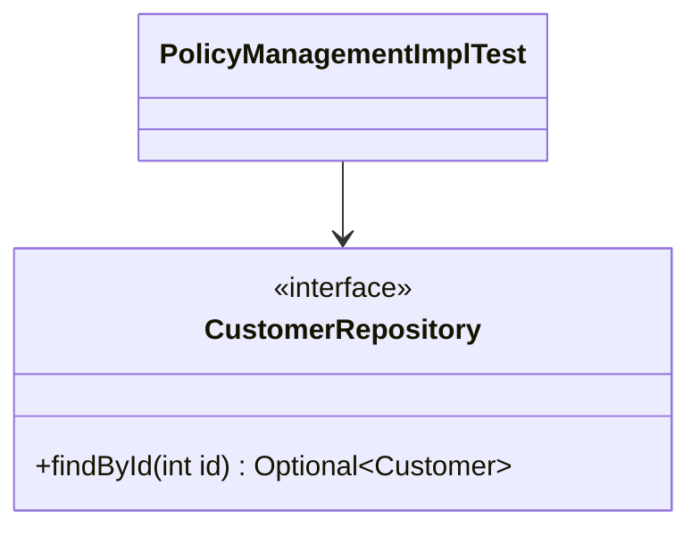
 
**Code-Beispiel:**

```java
@ExtendWith(MockitoExtension.class)
class PolicyManagementImplTest {
  
  @Mock
  private CustomerRepository customerRepository;

  @InjectMocks
  private PolicyManagementImpl policyManagement;

  @Test
  void add_policy_basic_with_senior_driver() throws Exception {
    // Create a customer with age > 80
      Customer customer = new TestCustomerDirector(new Customer.Builder()).createSeniorDriver();
      when(customerRepository.findById(1)).thenReturn(Optional.of(customer));

      Policy policy = new Policy(1, PolicyStatus.ACTIVE, PolicyProgram.BASIC, 10000);

      policyManagement.addPolicyToCustomer(1, policy);

      assertEquals(550, policy.getPremium().getAmount());
      assertEquals(1, customer.getPolicies().size());
      assertEquals(policy, customer.getPolicies().get(0));
  } 
}
```
**Beschreibung:**

Das Mock-Objekt *customerRepository* simuliert das Verhalten des `CustomerRepository`-Interfaces. Es wird verwendet, um die Abhängigkeit von der realen Implementierung zu isolieren und die Geschäftslogik von `PolicyManagementImpl` unabhängig zu testen. In diesem Test wird das Verhalten der `findById()`-Methode simuliert, sodass ein Senior-Customer zurückgegeben wird, ohne dass eine tatsächliche Datenbankabfrage durch den echten CustomerRepository stattfindet.

#### Mock-Objekt: `WriteCustomerManagement`
In den Tests des Adapters werden sämtliche Usecases gemockt. Dazu gehört das `WriteCustomerManagement`, aber auch `ReadCustomerManagement`, `PolicyManagement` und `TicketManagement`. Dies geschieht in der Testklasse `ConsoleAdapterTest`, um die Funktionsweise des Adapters unabhängig von der eigentlichen Geschäftlogik testen zu können. In den Tests des `ConsoleAdapter` werden außerdem die Methoden, die Nutzereingaben verlangen, gemockt, um automatisierte Tests zu ermöglichen, bei denen nicht manuell eine Eingabe erfolgen muss.

**UML:**

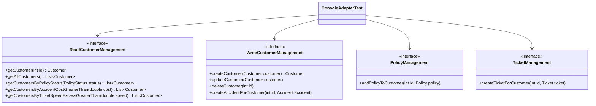

**Code-Beispiel:**

```java
@ExtendWith(MockitoExtension.class)
class ConsoleAdapterTest {

    @Mock
    private ReadCustomerManagement readCustomerManagement;

    @Mock
    private WriteCustomerManagement writeCustomerManagement;

    @Mock
    private PolicyManagement policyManagement;

    @Mock
    private TicketManagement ticketManagement;

    @InjectMocks
    private ConsoleAdapter consoleAdapter;

    @Test
        void createCustomer_success() {
            consoleAdapter = Mockito.spy(consoleAdapter);

            // Mocken der Eingabe-Methoden für automatisierte Tests
            doReturn(1).doReturn(12).when(consoleAdapter).getIntInput(anyString());
            doReturn("John").when(consoleAdapter).getStringInput(eq("Enter first name: "));
            doReturn("Doe").when(consoleAdapter).getStringInput(eq("Enter last name: "));
            doReturn(LocalDate.of(2000, 1, 1)).when(consoleAdapter)
                .getDateInput(eq("Enter date of birth (YYYY-MM-DD): "));
            doReturn("john.doe@example.com").when(consoleAdapter).getStringInput(eq("Enter email: "));
            doReturn("Street").when(consoleAdapter).getStringInput(eq("Street: "));
            doReturn("City").when(consoleAdapter).getStringInput(eq("City: "));
            doReturn("State").when(consoleAdapter).getStringInput(eq("State: "));
            doReturn("12345").when(consoleAdapter).getStringInput(eq("Zip Code: "));
            doReturn("Country").when(consoleAdapter).getStringInput(eq("Country: "));

            Customer createdCustomer = new CustomerDirector(new Customer.Builder()).buildNew(1, "John", "Doe",
                    LocalDate.of(2000, 1, 1), "john.doe@example.com",
                    new Address("Street", "City", "State", "12345", "Country"));
            when(writeCustomerManagement.createCustomer(any(Customer.class))).thenReturn(createdCustomer);

            consoleAdapter.start();

            String output = getOutput();

            assertTrue(output.contains("Customer created successfully with ID: 1"));
            verify(writeCustomerManagement, times(1)).createCustomer(any(Customer.class));
        }
}
```

**Beschreibung:**

Das Mock-Objekt *writeCustomerManagement* simuliert das Verhalten des `WriteCustomerManagement`-Interfaces. Es wird verwendet, um die Abhängigkeit von der realen Implementierung zu isolieren und die Adapter-Logik des `ConsoleAdapter` unabhängig von der Implementierung der Use-Cases zu testen. In den Tests wird das Verhalten der Methoden wie `createCustomer()`, `updateCustomer()`, etc. simuliert, ohne dass die tatsächliche Implementierung der Usecases (Business Logic) aufgerufen wird.


# 6. Domain-Driven-Design (DDD)
## Entities
- Customer
	- natürliche Person, die Kunde bei der von der Anwendung verwalteten Autoversicherung ist
	- Vor- und Nachname, PersonId, Geburtsdatum (vielleicht als VO), Mail, Adresse
- Policy
	- eine Versicherung, die ein Kunde für ein Auto abgeschlossen hat
	- Policystatus, entweder aktiv oder nicht aktiv
	- Policyprogram: Verweis auf ein Programm
	- CarValue
	- Premium (vielleicht als VO)
- Policyprogram
	- welche Art von Policy abgeschlossen wird
	- wirkt sich auf den Preis der Policy aus
	- Id, Name, Beschreibung
- Policystatus
	- beschreibt den Status einer abgeschlossenen Versicherung
  - vorhandene Status: aktive, inaktive, abgelehnt	
- Accidents
	- Unfälle, die ein Kunde begangen hat
	- Id, Schadenskosten, Datum
- Tickets
	- Verkehrsverstöße (in Bezug auf zu schnelles Fahren) von Kunden
	- Id, Datum, Geschwindigkeitsüberschreitung


## Nutzer
- Mitarbeiter der Versicherungsfirma
	- Kundenverwaltung
		- neuen Kunden im System anlegen
		- Policy für einen Kunden erstellen
		- alte Kunden und ihre Policys anzeigen
	- Accident hinzufügen
		- bei Kundenmeldung über einen Accident soll dieser in das System eingetragen werden
		- Änderungen an der spezifischen Policy des Kunden soll ersichtlicht werden
			- bis zu einer bestimmten Menge an Unfällen wird es teurer, die Policies können aber auch gekündigt werden
	- Ticket hinzufügen
		- bei Kundenmeldung über ein Ticket soll dieses in das System eingetragen werden
		- Änderungen an allen Policys des Kunden sollen ersichtlich werden
			- bis zu einer bestimmten Menge an Tickets oder ab einer bestimmten Geschwindigkeitsüberschreitung wird es teurer, die Policies können aber auch gekündigt werden


| Bezeichnung | Bedeutung                                                                               | Begründung                                                                                                                                                                                                                                                           |
| ----------- | --------------------------------------------------------------------------------------- | -------------------------------------------------------------------------------------------------------------------------------------------------------------------------------------------------------------------------------------------------------------------- |
| Policy      | eine Versicherung, die ein Kunde für ein Auto abgeschlossen hat                         | Ein Kunde schließt einen Vertrag für jede seiner Versicherungen ab (Insurance Policy). Bei einer Autoversicherung werden nur diese Art von Verträgen verwaltet, deswegen die kürzere Bezeichnung.                                                                    |
| Ticket      | Verkehrsverstöße von Kunden für zu schnelles Fahren                                     | Bei einer einer Autoversicherung sind für die Kostenberechnung einer Policy Geschwindigkeitsüberschreitungen releveant, da dadurch das Risiko eines Schadens erhöht wird. Andere Arten von Verkehrsvergehen, wie falsches Parken, werden dabei nicht berücksichtigt. |
| Customer    | natürliche Person, die Kunde bei der von der Anwendung verwalteten Autoversicherung ist | Kunden schließen einen Vertrag bei der Autoversicherung ab. Die Nutzer der Anwendung sind Mitarbeiter der Autoversicherung und tragen die Daten für die jeweiligen Kunden in das System ein.                                                                         |
| Premium     | die monatlichen Kosten einer Policy, um diese aktiv zu halten                           | Im Rahmen einer Versicherung wird Premium als der monatlich zu entrichtende Betrag definiert                                                                                                                                
## UML zu Entity

## Entities

### Policy Entity

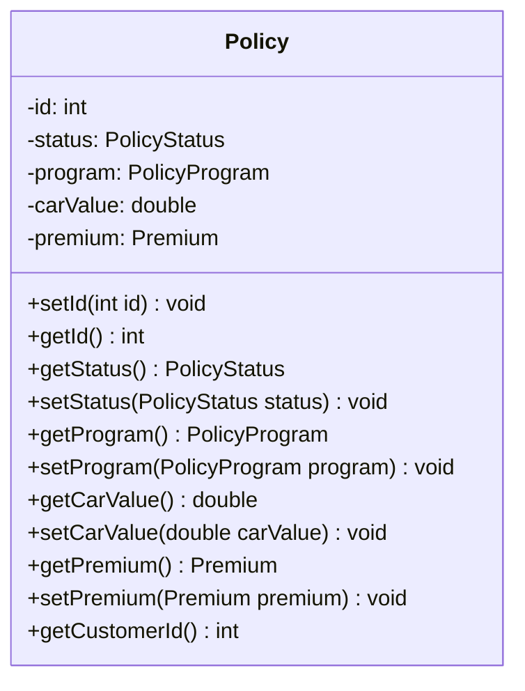


**Beschreibung**  
Die Entität *Policy* repräsentiert eine VersicherungsPolicy, die ein Kunde für ein spezifisches Auto abgeschlossen hat. Sie enthält wesentliche Informationen wie den Status der Policy, das gewählte Versicherungsprogramm, den Wert des versicherten Autos und die monatlichen Kosten.

**Begründung des Einsatzes:**  
Policy wird als Entity modelliert, weil:  
1. Sie eine eindeutige Identität hat (durch die id).  
2. Sie einen Lebenszyklus hat (der Status kann verändert werden).  
3. Sie sich im Laufe der Zeit ändern kann (z. B. Änderung der Kosten), behält aber ihre Identität.  
4. Sie eine zentrale Rolle im Modell spielt und mit anderen Entitäten (wie Customer) in Beziehung steht.  

---

## Value Objects

### Premium Value Object

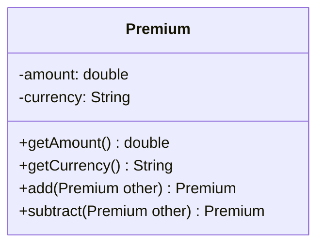

**Beschreibung:**  
Das Value Object *Premium* repräsentiert den Geldbetrag, den ein Kunde monatlich für seine VersicherungsPolicy zahlt. Es kapselt den Betrag und die Währung.

**Begründung des Einsatzes:**  
Premium wird als Value Object modelliert, weil:  
1. Es keine eigene Identität hat - zwei Premium-Objekte mit dem gleichen Betrag und der gleichen Währung sind austauschbar.  
2. Es unveränderlich (immutable) ist - Änderungen erzeugen ein neues Objekt.  
3. Es Verhaltenslogik enthält (z. B. Addition, Subtraktion), die für alle Premium-Objekte gleich ist.  
4. Es ein konzeptionell zusammengehöriges Paar von Werten (Betrag und Währung) repräsentiert.  

---

## Aggregates

### Customer Aggregate

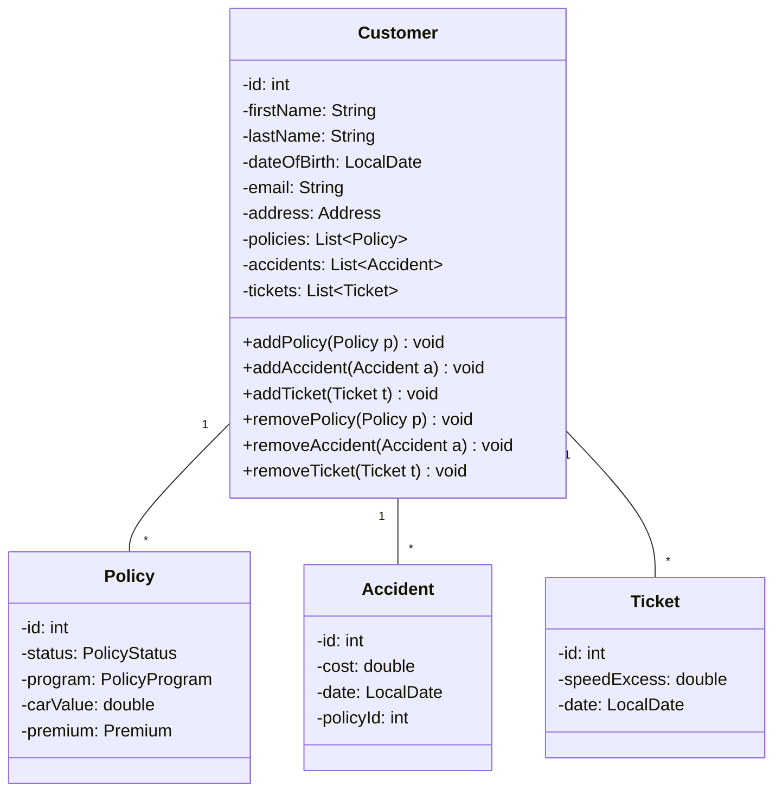

**Beschreibung:**  
Das Aggregate *Customer* gruppiert die Entitäten Customer, Policy, Accident und Ticket. Customer fungiert als Aggregate Root und hat direkte Verbindungen zu seinen Policies, Accidents und Tickets.

**Begründung des Einsatzes:**  
Ein Aggregat wird hier eingesetzt, weil:  
1. Es eine logische Gruppierung zusammengehöriger Entitäten darstellt. Ein Kunde hat Policys, Unfälle und Tickets, die alle direkten Einfluss auf die Versicherungskosten haben.  
2. Es die Konsistenz der Daten sicherstellt. Änderungen an Policies, Accidents oder Tickets müssen immer im Kontext des zugehörigen Kunden erfolgen.  
3. Es die Komplexität reduziert, indem es einen einzelnen Zugriffspunkt (Customer als Aggregate Root) für zusammengehörige Daten bietet.  

---

## Repositories

### Customer Repository

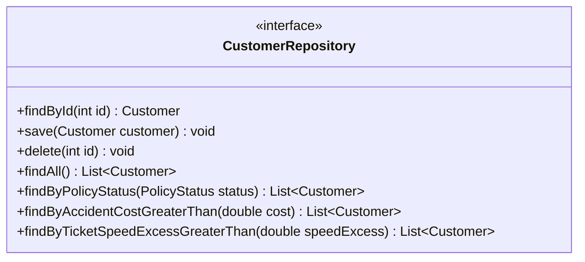

**Beschreibung:**  
Das Repository *Customer* ist verantwortlich für die Persistenz und das Abrufen des Aggregates Customer. Es bietet Methoden zum Finden, Speichern, Aktualisieren und Löschen von Kunden.

**Begründung des Einsatzes:**  
Ein Repository für Customer wird eingesetzt, weil:  
1. Es die Datenzugriffslogik von der Geschäftslogik trennt.  
2. Es eine Abstraktion der Datenpersistenz bietet, wodurch die zugrunde liegende Datenbank ohne Änderungen an der Geschäftslogik geändert werden kann.  
3. Es ermöglicht, komplexe Abfragen zu kapseln (z. B. findByName). 
4. Es unterstützt das Prinzip der Aggregate Root in DDD, da Customer ein Aggregate Root ist.  


# 8. Design Patterns
## Strategy Pattern
```mermaid
classDiagram
    class PremiumCalculationStrategy {
        <<interface>>
        +calculatePremium(double carValue) double
    }

    class BasicPremiumCalculationStrategy {
        -double percentage
        +calculatePremium(double carValue) double
    }

    class StandardPremiumCalculationStrategy {
        -double percentage
        +calculatePremium(double carValue) double
    }

    class DeluxePremiumCalculationStrategy {
        -double percentage
        +calculatePremium(double carValue) double
    }

    class PremiumCalculationStrategyFactory {
        +getStrategy(PolicyProgram program) PremiumCalculationStrategy
    }


    class PolicyProgram {
        <<enumeration>>
        BASIC
        STANDARD
        DELUXE
    }

    class PolicyManagementImpl {        
        +addPolicyToCustomer(int customerId, Policy policy)
    }

    PremiumCalculationStrategy <|.. BasicPremiumCalculationStrategy
    PremiumCalculationStrategy <|.. StandardPremiumCalculationStrategy
    PremiumCalculationStrategy <|.. DeluxePremiumCalculationStrategy
    PremiumCalculationStrategyFactory --> PremiumCalculationStrategy    
    PremiumCalculationStrategyFactory --> PolicyProgram        
    PolicyManagementImpl --> PremiumCalculationStrategyFactory   
    PolicyManagementImpl -->  PremiumCalculationStrategy
```

## Builder Pattern
```mermaid
classDiagram    
    class Customer {
      -id: int 
      -firstName: String 
      -lastName: String
      -dateOfBirth: LocalDate
      -email: String
      -address: Address
      -policies: List~Policy~
      -accidents: List~Accident~
      -tickets: List~Ticket~       
    }

    class Customer.Builder {
        +withId(int id) Builder
        +withFirstName(String firstName) Builder
        +withLastName(String lastName) Builder
        +withDateOfBirth(LocalDate dateOfBirth) Builder
        +withEmail(String email) Builder
        +withPolicies(List~Policy~ policies) Builder
        +withAccidents(List~Accident~ accidents) Builder
        +withTickets(List~Ticket~ tickets) Builder
        +build() Customer
    }

    class CustomerDirector {
        #Customer.Builder builder
        +CustomerDirector(Customer.Builder builder)
        +buildTemporary(String firstName, String lastName, LocalDate dateOfBirth, String email) Customer
        +buildNew(int id, String firstName, String lastName, LocalDate dateOfBirth, String email) Customer
        +buildNewFromObject(int id, Customer customer) Customer
    }

    class CustomerRepositoryImpl {
        -Map~Integer, Customer~ customers
        +findById(int id) Customer
        +save(Customer customer) void  
        +delete(int id) void
        +findAll() List~Customer~
        +findByPolicyStatus(PolicyStatus status) List~Customer~
        +findByAccidentCostGreaterThan(double cost) List~Customer~
        +findByTicketSpeedExcessGreaterThan(double speedExcess) List~Customer~
    }

    Customer.Builder -- Customer
    CustomerDirector --> Customer
    CustomerRepositoryImpl --> CustomerDirector
```
